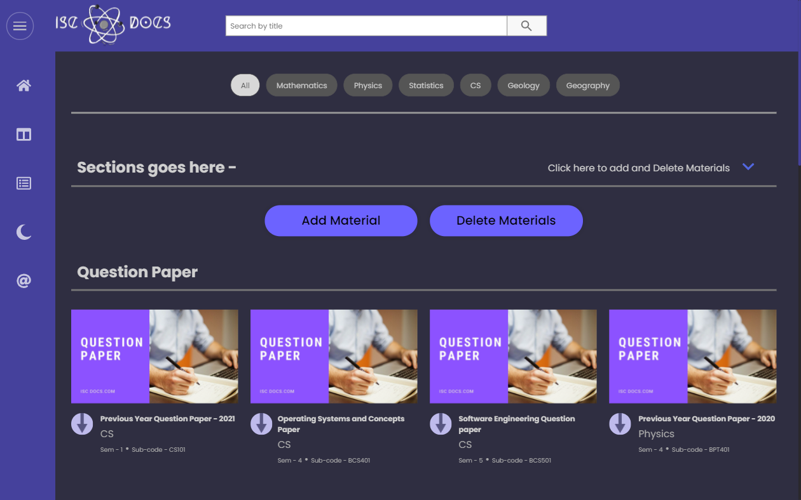
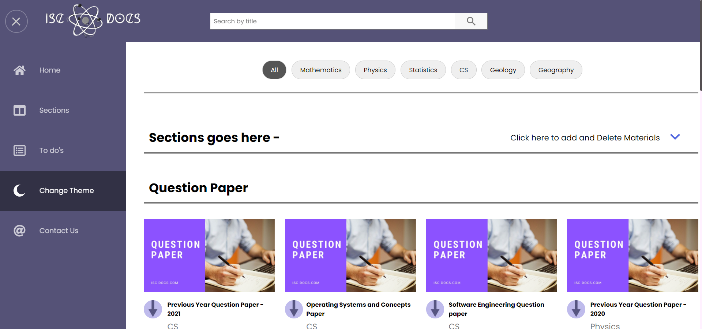
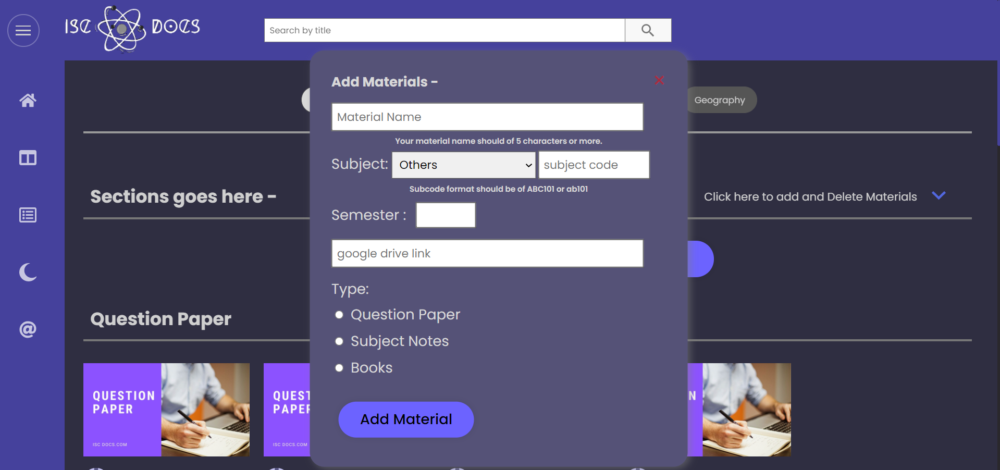
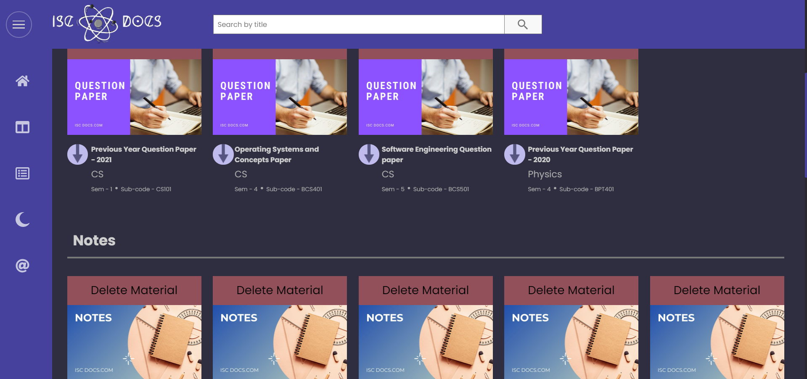

# ISC Docs - A web app

ISC Docs Tool Web app is a tool to manage all your cloud content at one place in a manageable way so as to seamlessly filter through content without any distraction or disturbance. It can also be used to bookmark important articles and search for them real quick whenever you need them.

## Table of contents

- [Overview](#overview)
  - [The Project](#the-project)
  - [Screenshot](#screenshot)
  - [Links](#links)
- [My process](#my-process)
  - [Built with](#built-with)
  - [What I learned](#what-i-learned)
  - [Continued development](#continued-development)
  - [Useful resources](#useful-resources)
- [Author](#author)
- [Acknowledgments](#acknowledgments)

## Overview

### The Project

Live URL - [@ISC Docs WebApp](https://iscdocs-web-app.netlify.app/)
Users should be able to:

- View the optimal layout for the site depending on their device's screen size
- Add Materials and Online Bookmarkable stuff using a simple form   
- Filter through content subject wise
- Also search for the material using simple search functionality

### Web app has some cons and they are listed below - 
- All the data is being stored in local storage so once you clear the local storage there is no going back.
- Web App will appear different on different devices due to data being stored in local storage as well as different on different browsers.
- Currently it is mainstreamed for academic purposes

### Screenshot

- Desktop Preview

- Tablet Preview

- Light theme

- Material Form to add materials

- Deleting Materials

## My process

### Built with

- Semantic HTML5 markup
- CSS custom properties
- Flexbox
- CSS Grid
- Vanilla Javascript

### What I learned

I learned how to create toggle elements using Vanilla Javascript using some primitive logic.
I don't feel very proud of CSS in this and  found that there is a major scope for learning and improvement especially
about Mobile first Workflow and Responsive design.
Still have ways to go around working with plain old JavaScript. But I did learn how to make a theme switcher with just css and javascript.
I learned how to use localStorage in an effective way.

### Continued development

- Make the UX rich and enriching
- Work on the Hamburger Menu and implement a flawless sliding menu
- Make CSS more compact and reduce the lines of code
- Implementation of the same Web App using React
- Adding backend to the Web App to secure user data.

### Useful resources

- [Dropdown Menu](https://www.w3schools.com/howto/howto_js_dropdown.asp) - This helped me with toggle different elements. 

- [Flexbox Guide](https://css-tricks.com/snippets/css/a-guide-to-flexbox/) - This is an amazing article/cheatsheet for Flexbox. I'd recommend it to anyone still learning this concept.

## Author

- Frontend Mentor - [@suraj-singh127](https://www.frontendmentor.io/profile/suraj-singh127)
- Linkedin - [@Suraj Singh](https://www.linkedin.com/in/suraj-singh-385673208)

## Acknowledgments

This was a really good fun mini project and I really enjoyed doing it. I got to know and implement many interesting things along with
my weakpoints on which I really need to work on along with brushing up the already strong points.
